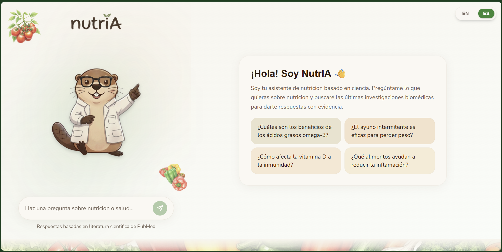
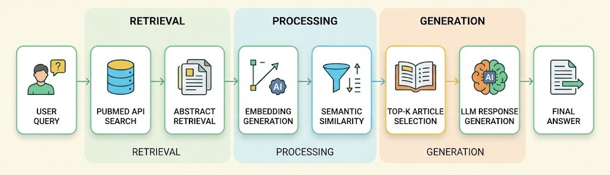
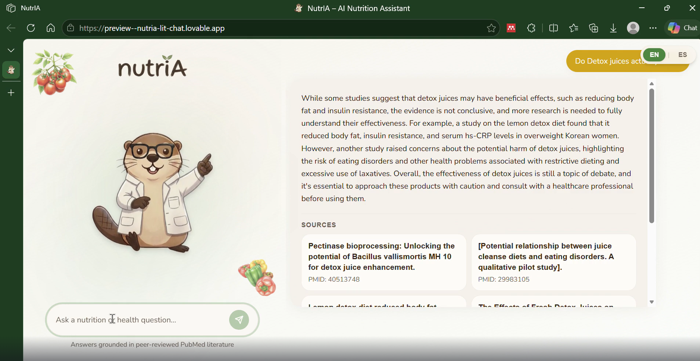

# NutrIA

**NutrIA** is an AI-powered nutritional literacy assistant that provides evidence-based answers to nutrition questions by retrieving and analyzing scientific literature from **PubMed**.

Instead of relying solely on a large language model, NutrIA follows a **Retrieval-Augmented Generation (RAG)** pipeline, ensuring every response is grounded in peer-reviewed biomedical research.



---

## Features

- Searches scientific literature directly from **PubMed**
- Uses semantic retrieval with **Sentence Transformers**
- Generates evidence-based responses using the **Groq API**
- Grounds every answer on retrieved scientific abstracts
- Displays the PubMed articles used to generate each response
- Modern bilingual (English/Spanish) web interface

---

## System Architecture

The NutrIA pipeline consists of five stages:

1. **User Query**
   - The user asks a question in natural language.

2. **Query Optimization**
   - The query is rewritten into a concise biomedical search query suitable for PubMed.

3. **Literature Retrieval**
   - PubMed is queried through the NCBI E-utilities API.
   - Relevant abstracts are downloaded.

4. **Semantic Ranking**
   - Sentence embeddings are computed using **all-MiniLM-L6-v2**.
   - The five most relevant abstracts are selected using cosine similarity.

5. **Response Generation**
   - The selected abstracts are provided to the language model.
   - The model generates an answer using only the retrieved scientific evidence.



---

## 💻 Technologies

### Backend

- Python
- FastAPI
- Groq API
- Sentence Transformers
- NumPy
- Requests
- PubMed E-utilities API

### Frontend

- React
- TypeScript
- Tailwind CSS
- Lovable

---

## Installation

### Clone the repository

```bash
git clone https://github.com/danielafercis9/NutrIA.git
cd NutrIA
```

### Backend

Install the required packages:

```bash
cd backend
pip install -r requirements.txt
```

Create a `.env` file:

```text
GROQ_API_KEY=your_groq_api_key
```


After installing the required dependencies and configuring the environment variables, launch the FastAPI application with:

```bash
uvicorn app:app --reload
```
The backend exposes a REST API that can be accessed locally during development or deployed to a cloud service for production use. The frontend communicates with this API through standard HTTP requests.

---
### Frontend

```bash
cd frontend
npm install
npm run dev
```
## Example Questions

- Is intermittent fasting effective for weight loss?
- Does vitamin D improve bone density?
- Is coffee consumption associated with cardiovascular disease?
- Is creatine safe for adolescents?
- What are the health effects of consuming ultra-processed foods?

---

## Disclaimer

NutrIA is intended **for educational purposes only**.

The information provided is based on published scientific literature and should **not** replace professional medical advice, diagnosis, or treatment.

---

## 📜 License

This project is distributed under the **MIT License**.

See the `LICENSE` file for more information.
